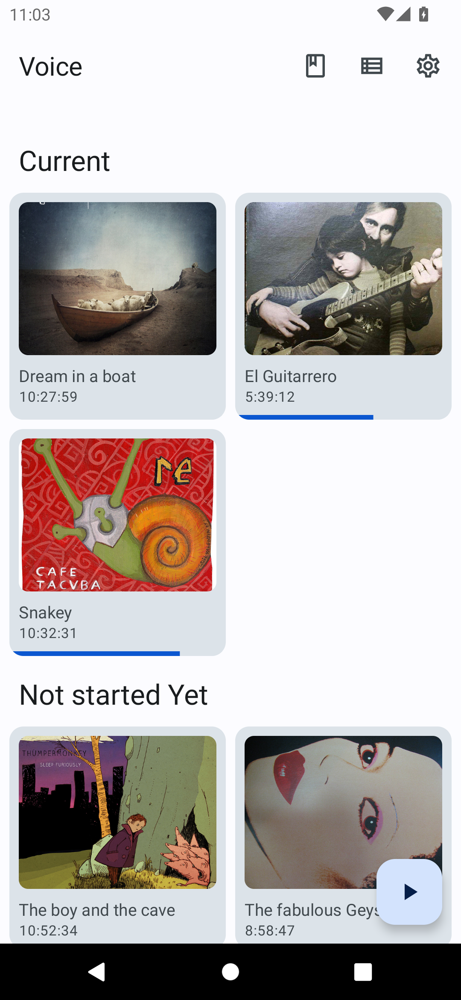
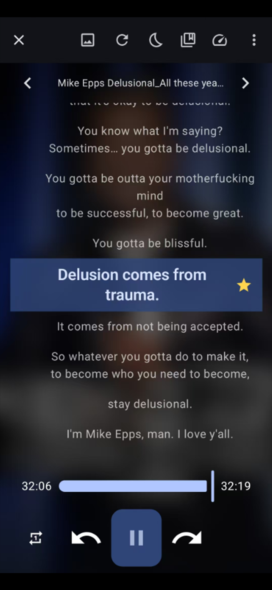
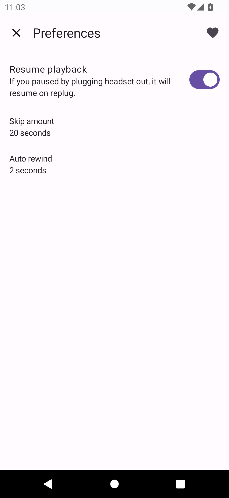
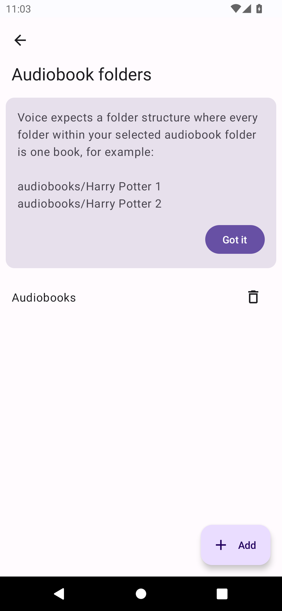

# Subtitle Practice Fork

 

This is a GPLv3-licensed fork of Voice by Paul Woitaschek.

Original project: <https://github.com/PaulWoitaschek/Voice>

Built for subtitle listening practice:

- Load `.srt` subtitles from the same folder as your audiobook
- Pick subtitles from SAF / `content://` sources
- Tap a subtitle to seek playback
- Highlight the current subtitle line while listening
- Star lines for review and practice
- Keep offline audiobook playback when no subtitles are available

## UI Preview

| Library | Now Playing | Subtitle Sync | Review |
| --- | --- | --- | --- |
|  |  |  |  |

## License

This fork is licensed under GNU GPLv3, the same terms as the original project. The original project is licensed under [GNU GPLv3](docs/license). By contributing, you agree to license your code under the same terms.
